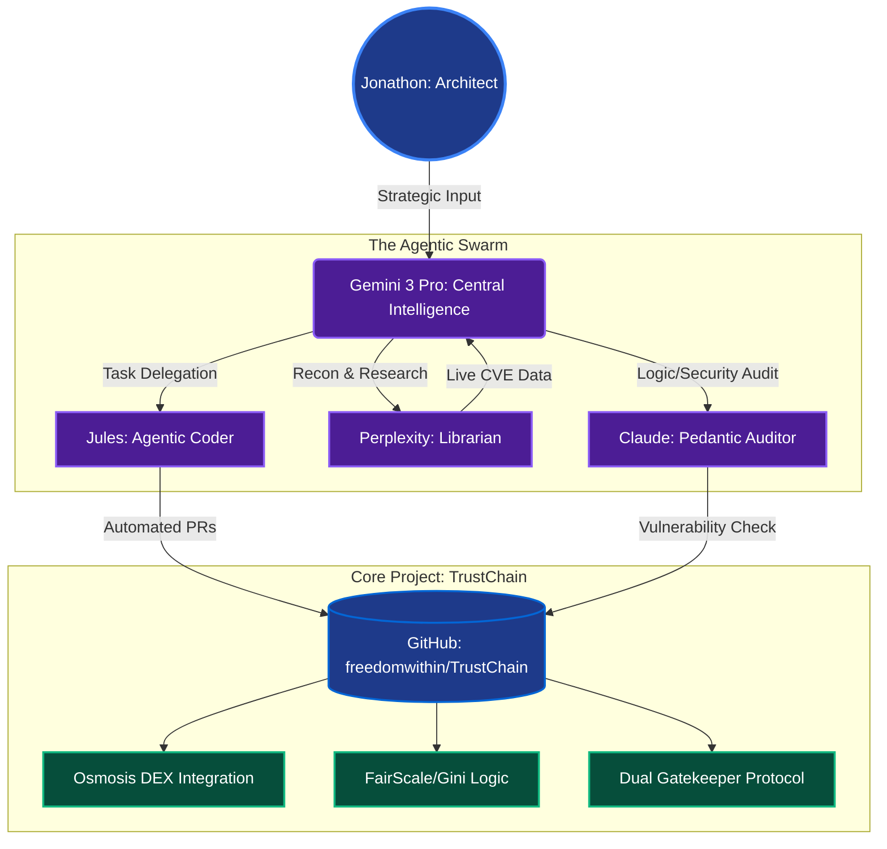

<div align="center">

# TrustChain-Sovereign: Backend
### Solana-Native Behavioral Firewall & Reputation Engine

**Live Interface:** [trustchainsovereign.com](https://trustchainsovereign.com)  
**System Demo:** [Watch the Full System Demo on Vimeo](https://vimeo.com/1167869054)  
**Legacy Endpoint:** [trustchain-sovereign-frontend.vercel.app](https://trustchain-sovereign-frontend.vercel.app)  
**Project Status:** Institutional Hardening (Production-Ready)  
**Build Version:** 2.1.5-Sovereign (Hardened)

</div>

---

## Judging Quick-Start

To replicate the full behavioral notarization and governance simulation in under 5 minutes, please follow the [Quick-Start Demo Guide](QUICKSTART_judges.md).

---

## 🏛️ Sovereign Architecture & Strategy

Since the initial submission, TrustChain has undergone a **Sovereign Hardening** phase to move from prototype heuristics to an institutional-grade security primitive.

### 📊 Roadmap & Technical Pitch

For a deep dive into the **Gini/HHI Dual Gatekeeper** math, our **Helius gRPC pipeline**, and the **90-day Shadow Audit Roadmap**, refer to our strategic documentation:

- **[View Technical Pitch & Roadmap (PPTX)](./docs/TrustChain_Sovereign_Deck.pptx)**

### ⚡ Infrastructure Upgrades

- **Helius gRPC (Yellowstone):** Migrated to a direct data-push stream to maintain a deterministic **3,000ms sync window**.
- **Anchor Notary Bridge:** All behavioral integrity scores are notarized to on-chain **PDAs**, making reputation a composable and immutable primitive on Solana.
- **Gini/HHI Forensics:** Implementation of macro-economic concentration indices to detect coordinated clusters rather than isolated wallets.

---

## Updates

### 🏛️ Audit & Commit History
This repository represents the consolidated **Sovereign Hardening** phase. The full audit trail of our development journey—from initial proof-of-concept to the current gRPC implementation—is preserved in the original development roots:
* **[TrustChain Core](https://github.com/Freedomwithin/TrustChain)** — *Early behavioral logic and proof-of-concept.*
* **[TrustChain Sovereign](https://github.com/Freedomwithin/TrustChain-Sovereign)** — *Infrastructure hardening and gRPC integration.*

### 2026-02-25 — Institutional Hardening (v2.2.1)

**Risk Auditor Agent**  
Integrated `RiskAuditorAgent.js` to provide autonomous behavioral auditing. Thresholds are hardened at `PROBATIONARY_SYNC_INDEX_THRESHOLD: 0.35` and `GINI_THRESHOLD: 0.7` to capture sophisticated Sybil clusters that evade single-metric detection.

**Non-Blocking Notarization**  
Notarization decisions are now written to the Solana PDA as an asynchronous side-effect rather than blocking the response cycle, ensuring sub-2,000ms response times under all load conditions.

**Helius gRPC Migration**  
Fully transitioned to Yellowstone (gRPC) to eliminate RPC tail latency. The previous HTTP/JSON RPC path is retired.

**The "Goldilocks" Scan Window**  
Standardized on a 15-transaction DNA Profile scan — calibrated for 95%+ forensic accuracy without hitting I/O bottlenecks or triggering rate limits during high-concurrency evaluation periods.

---

### February 2026 — Sovereign Integration

**Helius RPC Migration**  
Transitioned to **Helius RPC** to ensure high-fidelity indexing of Solana balance metadata. Standard RPC endpoints throttle or drop the pre/post balance data required for accurate Gini/HHI behavioral scoring — Helius resolves this at the infrastructure level.

**Latency Optimization**  
Standardized the transaction scan limit at **15 transactions** to balance data variance with performance. This keeps the Temporal Sentinel sync window within its 2,000ms threshold while providing sufficient behavioral signal for the Gini engine to produce meaningful scores.

**Notary Identity Stabilization**  
On-chain notarization is now locked to the `JCq7...` Notary identity. This creates a persistent, cryptographically verifiable link between a wallet's behavioral history and its governance power — queryable by any external Solana protocol directly from the ledger.

---

## What This Is

TrustChain-Sovereign is a **read-only behavioral firewall and reputation layer** for Solana DeFi. It addresses the *Sybil Gap* — the inability of on-chain protocols to distinguish genuine liquidity providers from bot-operated wallets — by combining FairScale's social reputation layer with proprietary on-chain behavioral analysis.

This repository contains the **backend only**: the Node.js/TypeScript Express server deployed on Vercel that powers the Integrity Engine, FairScale integration, and Anchor Notary Bridge.

> The frontend (React 18 / Vite HUD) lives in a separate repository as part of the decoupled V2.2 infrastructure.

---

## FairScale Integration (Fairathon Submission)

TrustChain goes beyond simple API gating. FairScale social reputation is a **weighted first-class signal** in the integrity scoring formula:

```
TotalIntegrityScore = (TrustChainBehavioral × 0.7) + (FairScaleSocial × 0.3)
```

The FairScale score is not an override or a fallback — it is structurally embedded in every wallet evaluation. This means:

- A wallet with a **high FairScore cannot mask predatory on-chain behavior**: the behavioral signal (70%) will surface it.
- A wallet with a **perfect behavioral record but no social reputation** will be capped below the Elite Verified tier.
- The integration actively defends against **Social Sybils** — wallets that appear human due to social activity but execute bot-like liquidity patterns.

**API integration:** FairScale scores are fetched in real time, cached for 60 seconds per wallet using an in-memory `Map` with `timer.unref()` to prevent memory leaks in long-running server processes. Input values are sanitized with `Number.isFinite()` and strict clamping to prevent NaN-based score bypasses from malformed API responses.

---

## Core Architecture

### 1. Dual-Gatekeeper Behavioral Engine (70% of score)

On-chain wallet behavior is analyzed using two complementary concentration metrics:

- **Gini Coefficient** — detects inequality in liquidity provision. A high Gini signals a wallet extracting value in single-block bursts rather than providing persistent liquidity.
- **HHI (Herfindahl-Hirschman Index)** — detects transaction concentration. Catches "Whale" manipulation patterns that a Gini check alone would miss.

Protocols can set custom thresholds (e.g., `Gini < 0.3`) to protect their pools without any changes to TrustChain's core logic.

### 2. Advanced Temporal Sentinel

The Temporal Sentinel monitors transaction flow within a **2,000ms sliding window** to detect ultra-high-frequency (UHF) bot activity. It uses a Max-Signal approach — rather than a single linear check, it cross-references two independent signals:

- **Coefficient of Variation (CV)** — catches *Rhythmic Bots* operating on fixed automation intervals.
- **Weighted Temporal Burst Detection** — catches *Aggressive Bots* executing high-frequency clusters.

If either signal exceeds the `0.8` notarization threshold, the wallet is flagged. This dual-signal design prevents bots from evading detection by making one metric look clean while the other reveals the pattern.

### 3. Anchor Notary Bridge

Integrity scores are notarized directly to **Solana PDAs** via the deployed Anchor Notary Program. This creates a permanent, on-chain reputation layer that any external protocol can query directly from the ledger — no API call required.

Notarization requires a **1.0 SOL Notary Stake**, which makes Sybil cluster attacks economically non-viable at scale while remaining frictionless for legitimate users.

---

## Reputation Tiers

| Tier | Criteria | Access |
|---|---|---|
| **PROBATIONARY** | 0–2 transactions or low FairScore | Monitoring only |
| **VERIFIED** | 3+ transactions, behavioral maturity confirmed | Standard protocol access |
| **ELITE_VERIFIED** | Weighted score ≥ 85 (behavioral + FairScale) | Institutional Liquidity Insights |

The 3-transaction minimum on full Gini/HHI analysis is an intentional **probationary guardrail** to eliminate false positives on new wallets.

---

## Demo & Testing

The live demo video walks through the full end-to-end system including the FairScale weighted scoring, Temporal Sentinel firing, and on-chain notarization.

**[Watch Full System Demo →](https://vimeo.com/1167869054)**

The demo uses a **behavioral hydration script** to simulate wallet transaction patterns (e.g., bot-like burst activity vs. persistent LP behavior) so the Sentinel and Gini/HHI engine can be observed firing in real time without requiring live mainnet bot activity. This is a dev/demo utility — the production system evaluates real on-chain transaction history.

---

## Security & Resilience

- **No keys, no signing, no execution**: The backend operates in strict shadow/read-only mode. It never holds private keys, signs transactions, or affects protocol execution.
- **Fail-safe API contract**: The server returns a hard `500` on internal failures rather than silent fallbacks, ensuring monitoring systems (Vercel/Sentry) catch outages immediately.
- **State hygiene**: Frontend state updates use functional updaters (`prev => !prev`) to prevent race conditions during rapid Sentinel state changes.
- **Input sanitization**: All external API responses (including FairScale) are validated with `Number.isFinite()` and clamped before entering the scoring formula.

---

## Tech Stack

| Layer | Technology |
|---|---|
| Runtime | Node.js / TypeScript |
| Framework | Express |
| Blockchain | Solana — Anchor, @solana/web3.js |
| RPC | Helius (High-Fidelity Indexing) |
| Reputation | FairScale API + TrustChain Gini/HHI Engine |
| Deployment | Vercel (Production) |
| SDK | `@trustchain/web3-react` — `useTrustChain()` hook |

---

## API Reference

**Base URL:** `https://trustchain-sovereign-backend.vercel.app`

```
GET /api/pool/:poolId/integrity
```

Sample response:
```json
{
  "wallet": "ABC123...",
  "behavioralScore": 82,
  "fairScaleScore": 74,
  "totalIntegrityScore": 79.4,
  "giniCoefficient": 0.18,
  "hhiIndex": 0.21,
  "status": "VERIFIED",
  "syncIndex": 0.12,
  "notarized": true
}
```

The `useTrustChain()` SDK hook abstracts this endpoint for frontend consumers, returning `status`, `gini`, and `syncIndex` in a single performant call.

---

## High-Velocity Agentic Workflow
This repository is managed by an **Agentic Swarm**, enabling enterprise-grade development velocity:
- **Architect:** Jonathon (Human)
- **Agentic Coder:** Jules (Gemini 3 Pro)
- **Logic Auditor:** Claude (Security Audit)



---

**Architect:** Jonathon | Freedomwithin  
**Infrastructure:** [trustchain-sovereign-backend.vercel.app](https://trustchain-sovereign-backend.vercel.app)  
**Contact:** [X / Twitter @TrustChainDev](https://x.com/TrustChainDev/)